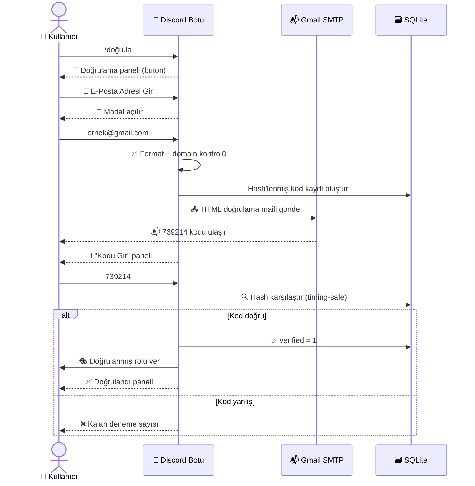
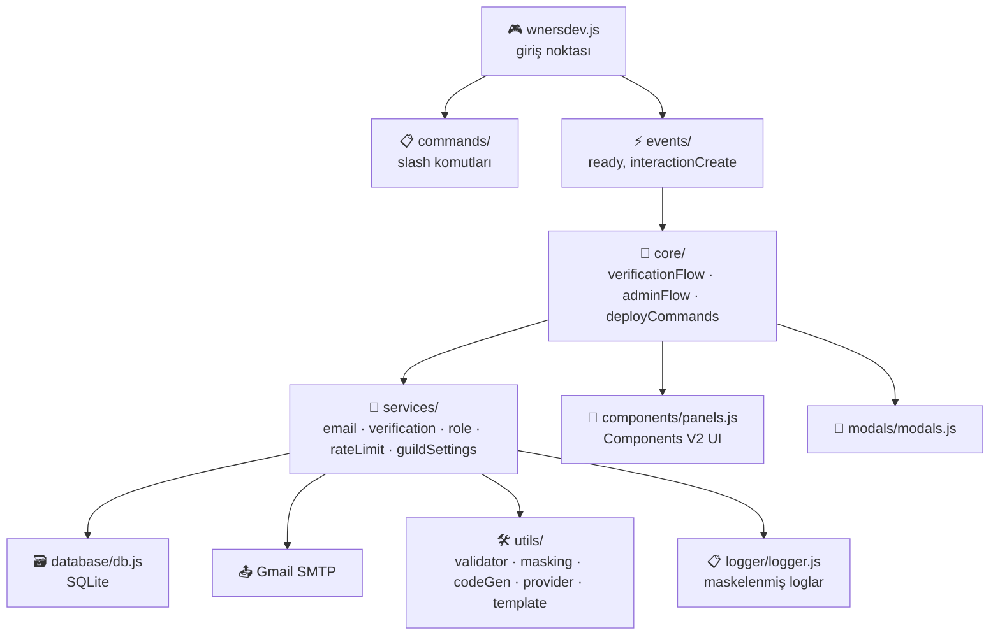

<div align="center">

```
██╗    ██╗███╗   ██╗███████╗██████╗ ███████╗██████╗ ███████╗██╗   ██╗
██║    ██║████╗  ██║██╔════╝██╔══██╗██╔════╝██╔══██╗██╔════╝██║   ██║
██║ █╗ ██║██╔██╗ ██║█████╗  ██████╔╝███████╗██║  ██║█████╗  ██║   ██║
██║███╗██║██║╚██╗██║██╔══╝  ██╔══██╗╚════██║██║  ██║██╔══╝  ╚██╗ ██╔╝
╚███╔███╔╝██║ ╚████║███████╗██║  ██║███████║██████╔╝███████╗ ╚████╔╝
 ╚══╝╚══╝ ╚═╝  ╚═══╝╚══════╝╚═╝  ╚═╝╚══════╝╚═════╝ ╚══════╝  ╚═══╝
```

# 📧 Discord E-Posta Doğrulama Sistemi

**Sahte üyeleri değil, gerçek e-posta sahiplerini içeri al.**

[](https://nodejs.org)
[](https://discord.js.org)
[](https://discord.com/developers/docs/components/reference)
[](https://www.sqlite.org/)
[](https://nodemailer.com/)
[](#-lisans)

</div>

---

## 📌 İçindekiler

- [Bu Bot Ne Yapar?](#-bu-bot-ne-yapar)
- [Özellikler](#-özellikler)
- [Kullanıcı Akışı (Görsel)](#-kullanıcı-akışı-görsel)
- [Panel Önizlemeleri](#-panel-önizlemeleri)
- [Mimari](#-mimari)
- [Dosya Yapısı](#-dosya-yapısı)
- [Kurulum](#-kurulum)
- [Komutlar](#-komutlar)
- [Güvenlik](#-güvenlik)
- [Sık Sorulan Sorular](#-sık-sorulan-sorular)
- [Lisans](#-lisans)

---

## 🎯 Bu Bot Ne Yapar?

Discord sunucundaki her üye gerçek biri olsun istiyorsun ama Discord'un
kendisi e-posta sahipliğini doğrulamıyor. Bu bot, boşluğu dolduruyor:

> Kullanıcı kendi e-posta adresini girer → bot bu adrese gerçek bir kod
> gönderir → kullanıcı kodu Discord içinden girer → **e-posta sahipliği
> kanıtlanmış olur** → doğrulanmış rol otomatik verilir.

Kullanıcının Gmail/Outlook/Yahoo şifresi **hiçbir zaman** istenmez.
Sistem sadece botun kendi Gmail hesabından **giden** mail atar.

---

## ✨ Özellikler

| Kategori | Özellik |
|---|---|
| 🔐 **Doğrulama** | 6 haneli kriptografik kod, SHA-256 hash ile saklama, timing-safe karşılaştırma |
| ⏱️ **Süre & Limit** | Guild başına ayarlanabilir kod süresi, deneme limiti, resend cooldown |
| 📨 **Mail** | Gmail SMTP (App Password), premium dark-mode HTML e-posta şablonu, tekil `EmailService` (transporter yeniden kullanılır) |
| 🌐 **Domain Kontrolü** | Format doğrulama + best-effort MX/DNS kontrolü, sağlayıcı tespiti (Gmail/Outlook/Yahoo/iCloud/Proton/Generic) |
| 🎭 **Rol Yönetimi** | Doğrulama sonrası otomatik rol; izin/hiyerarşi sorunu varsa bot **çökmez**, kullanıcı bilgilendirilir |
| 🛡️ **Anti-Abuse** | Kullanıcı, e-posta ve guild bazlı rate limiting; 5 yanlış denemede kod otomatik geçersiz |
| 🕶️ **Gizlilik** | E-posta maskeleme (`en***@gmail.com`), loglarda kod asla tutulmaz |
| 🧩 **Arayüz** | %100 gerçek Discord **Components V2** (Container, TextDisplay, Section, Select Menu, Modal) — sahte kütüphane yok |
| 👑 **Yönetim** | `/panel` içinde açılır menülü tam kontrol: rol, süre, limit, cooldown, istatistik, log, test |
| 📊 **Analitik** | Günlük/toplam doğrulama sayısı, en çok kullanılan sağlayıcılar |
| 🧪 **Test Paketi** | `/test mail\|kod\|rol\|smtp\|database` — canlıya almadan her parçayı doğrula |
| 🗃️ **Veritabanı** | SQLite (better-sqlite3) — kurulum gerektirmez, tek dosya, senkron ve hızlı |
| 🧱 **Kod Kalitesi** | `.env` yok, her şey `ayarlar.json`; sade, modüler, gereksiz abstraction yok |

---

## 🔄 Kullanıcı Akışı (Görsel)



---

## 🖼️ Panel Önizlemeleri

> Gerçek Discord ekran görüntüleri her sunucunun temasına göre değişeceği
> için burada botun ürettiği **Components V2** panellerinin tam çıktısı
> gösteriliyor — kurulumdan sonra Discord'da birebir bunu göreceksin.

<table>
<tr>
<td valign="top">

**1️⃣ `/doğrula`**
```
📧 E-Posta Doğrulama
────────────────────
Discord hesabını doğrulamak için
e-posta adresini aşağıdaki
butondan gir.

🔒 E-posta adresin gizli tutulur.

[ 📨 E-Posta Adresi Gir ]
```

</td>
<td valign="top">

**2️⃣ Kod Gönderildi**
```
📬 Kod Gönderildi
────────────────────
📧 Adres: en***@gmail.com

Kodunu e-postana gönderdik.

[🔢 Kodu Gir] [📨 Tekrar Gönder] [❌ İptal]
```

</td>
</tr>
<tr>
<td valign="top">

**3️⃣ Başarılı**
```
✅ Doğrulandı
────────────────────
E-posta adresin başarıyla
doğrulandı.

📧 en***@gmail.com
🕐 03.09.2026 03:42

🎉 Artık doğrulanmış üyesin.
🎭 Doğrulanmış rolün verildi.
```

</td>
<td valign="top">

**4️⃣ `/panel` (Yönetici)**
```
👑 Yönetici Paneli
────────────────────
Durum: 🟢 Açık
Rol: @Doğrulanmış
Kod Süresi: 5 dakika
Deneme Limiti: 5
Resend Cooldown: 60sn

[ Bir bölüm seç ▾ ]
  🔴 Sistemi Kapat
  🎭 Doğrulanmış Rol
  ⏱️ Kod Süresi
  🔢 Deneme Limiti
  🔄 Resend Cooldown
  📊 İstatistik
  📋 Loglar
  🧪 Test
```

</td>
</tr>
</table>

Ve gerçek e-posta şablonu — koyu, premium bir kart tasarımı:

```
   ╭──────────────────────────────╮
   │              ✦                │
   │       E-posta Doğrulama       │
   │                                │
   │  ┌──────────────────────┐    │
   │  │       7 3 9 2 1 4      │    │
   │  └──────────────────────┘    │
   │                                │
   │   5 dakika geçerlidir.        │
   │   Bu kodu kimseyle paylaşma.  │
   ╰──────────────────────────────╯
```

---

## 🏗️ Mimari



---

## 📁 Dosya Yapısı

```
📦 discord-email-verify
├── 🚀 wnersdev.js              ← ana giriş dosyası (buradan başla)
├── 📄 package.json
├── 🔐 ayarlar.example.json     ← kopyala → ayarlar.json yap
├── 🙈 .gitignore
├── 📖 README.md
│
├── 📋 commands/                 /doğrula, /panel, /ayarlar, /test ...
├── 🧩 components/panels.js      Components V2 panel üreticileri
├── 📝 modals/modals.js          email & kod giriş modalleri
├── ⚡ events/                    ready.js, interactionCreate.js
├── 🔀 core/                      akış mantığı + deployCommands.js
├── 🧠 services/                  email, verification, role, rate-limit
├── 🗃️ database/db.js             SQLite şeması
├── 🛠️ utils/                     validation, masking, code, provider, template
├── 🔒 middleware/permissions.js  yönetici izin kontrolü
└── 📋 logger/logger.js           maskelenmiş event logları + hata dosyası
```

> `data/` (SQLite dosyası) ve `logs/` (hata kayıtları) ilk çalıştırmada
> otomatik oluşturulur ve `.gitignore` içindedir.

---

## ⚙️ Kurulum

### 1. Bağımlılıkları yükle

```bash
npm install
```

### 2. Config dosyasını oluştur

```bash
cp ayarlar.example.json ayarlar.json
```

```jsonc
{
  "token": "DISCORD_BOT_TOKEN",
  "clientId": "DISCORD_CLIENT_ID",
  "guildId": "TEST_GUILD_ID",       // boş bırakılırsa global (yayılması saatler sürer)

  "gmail": {
    "adres": "botmail@gmail.com",
    "sifre": "GMAIL_APP_PASSWORD"   // ⚠️ normal şifre DEĞİL
  },

  "verification": {
    "verifiedRole": "ROLE_ID",
    "codeExpiryMinutes": 5,
    "maxAttempts": 5,
    "resendCooldownSeconds": 60
  }
}
```

> 🔑 **Gmail App Password nasıl alınır?**
> 1. Gmail hesabında **2 Adımlı Doğrulama**'yı aç.
> 2. [myaccount.google.com/apppasswords](https://myaccount.google.com/apppasswords) adresine git.
> 3. "Diğer" seçip bir isim ver (örn. `discord-bot`), üretilen 16 haneli şifreyi `gmail.sifre` alanına yapıştır.

`ayarlar.json` **asla** paylaşılmamalı veya repoya eklenmemeli — zaten
`.gitignore` içinde.

### 3. Discord Developer Portal ayarları

Bot için şu izinler gerekli: `applications.commands`, `bot` intent'i ile
**Send Messages**, **Manage Roles**, **Use Application Commands**.
Doğrulanmış rol, botun kendi rolünün **altında** olmalı — yoksa rol
verilemez (bot çökmez, sadece kullanıcıyı bilgilendirir).

### 4. Komutları yükle ve botu başlat

```bash
npm run deploy   # slash komutlarını Discord'a yükler
npm start        # wnersdev.js'i çalıştırır
```

Başarılı girişte terminalde şunu görürsün:

```
✅ 9 komut yüklendi (guild).
✅ Giriş yapıldı: SeninBotun#0000
```

---

## 💬 Komutlar

<table>
<tr><th>Komut</th><th>Kim kullanabilir</th><th>Ne yapar</th></tr>
<tr><td><code>/doğrula</code></td><td>Herkes</td><td>Doğrulama akışını başlatır</td></tr>
<tr><td><code>/doğrulama durum</code></td><td>Herkes</td><td>Kendi doğrulama durumunu gösterir</td></tr>
<tr><td><code>/doğrulama iptal</code></td><td>Herkes</td><td>Aktif süreci iptal eder</td></tr>
<tr><td><code>/status</code></td><td>Herkes</td><td>Bot ping / uptime / sistem durumu</td></tr>
<tr><td><code>/yardım</code></td><td>Herkes</td><td>Komut listesi</td></tr>
<tr><td><code>/panel</code></td><td>Yönetici</td><td>Açılır menülü tam kontrol paneli</td></tr>
<tr><td><code>/ayarlar rol\|sure\|deneme\|cooldown\|ac\|kapat</code></td><td>Yönetici</td><td>Tekil hızlı ayar değişimi</td></tr>
<tr><td><code>/istatistik</code></td><td>Yönetici</td><td>Günlük/toplam analitik</td></tr>
<tr><td><code>/test mail\|kod\|rol\|smtp\|database</code></td><td>Yönetici</td><td>Sistemi uçtan uca test eder</td></tr>
</table>

---

## 🔒 Güvenlik

- ❌ Kullanıcının e-posta şifresi **hiçbir zaman** istenmez, saklanmaz.
- ❌ Kullanıcı hesaplarına IMAP/POP3 ile giriş denenmez, credential checker yoktur.
- ✅ Doğrulama kodları veritabanına yalnızca **SHA-256 hash** olarak yazılır.
- ✅ Kod karşılaştırması **timing-safe** (`crypto.timingSafeEqual`).
- ✅ Loglarda kod asla tutulmaz; e-posta adresleri maskelenir (`en***@gmail.com`).
- ✅ SMTP hataları kullanıcıya genel bir mesajla gösterilir; tam stack trace
  yalnızca yerel `logs/error.log` dosyasına yazılır, Discord'a asla basılmaz.
- ✅ Kullanıcı, e-posta ve guild bazlı rate limiting ile spam/abuse engellenir.

---

## ❓ Sık Sorulan Sorular

**Mail gönderilmiyor, ne yapmalıyım?**
`/test smtp` komutunu çalıştır. Başarısızsa `logs/error.log` dosyasına bak —
genelde App Password yanlış veya Gmail hesabında "less secure app" değil
**App Password** kullanılmadığı için olur.

**Rol verilmiyor?**
`/test rol` komutu botun rolünün hedef rolün **üstünde** olup olmadığını ve
`Manage Roles` izninin olup olmadığını kontrol eder.

**Neden `.env` yok?**
Proje özellikle `ayarlar.json` üzerinden yapılandırılacak şekilde
tasarlandı — tüm config tek yerde, JSON formatında ve `.gitignore`'da.

**Domain'im MX kontrolünden geçmedi ama gerçek bir adres, ne oluyor?**
MX kontrolü sadece bilgilendirme amaçlıdır ve e-postayı **engellemez** —
gerçek doğrulama zaten kod ile yapılır.

---

## 📜 Lisans

MIT — dilediğin gibi kullan, değiştir, dağıt.

<div align="center">

**Sıfırdan yazıldı. Sahte fonksiyon yok. Yarım sistem yok.** 🏆

</div>
